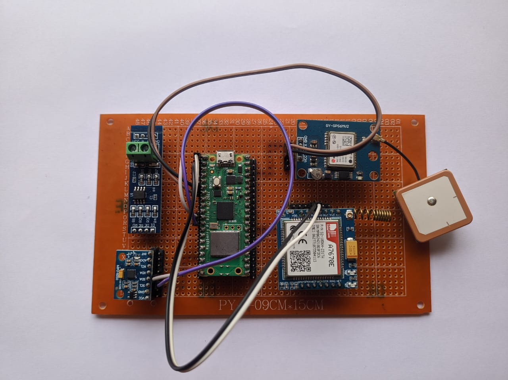
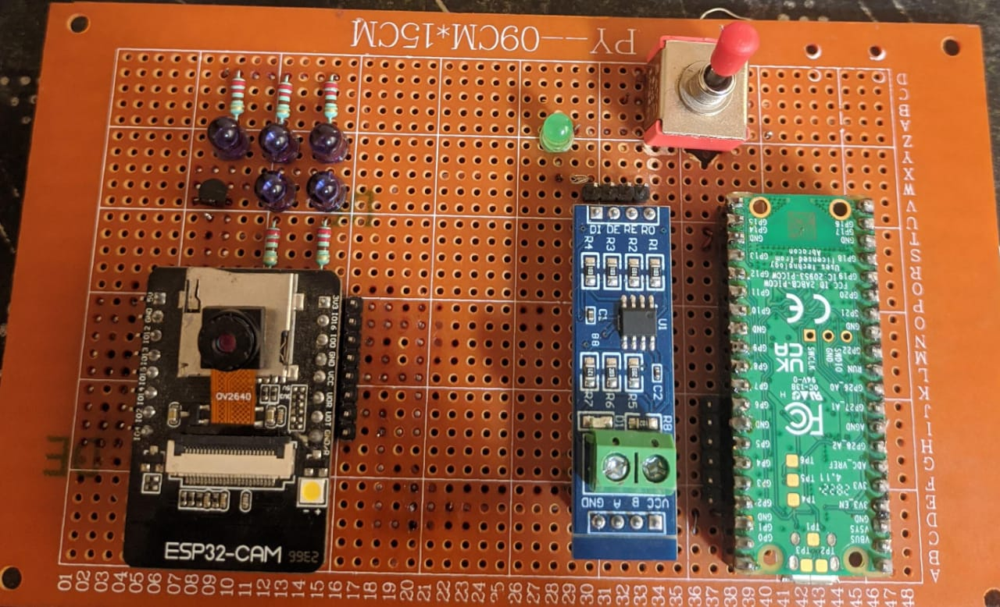
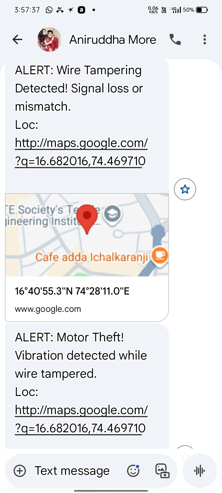

# 🌾 FarmSecureX – Smart Surveillance System for Agriculture Motor & Cable Theft Detection

<p align="center">
  
  &nbsp;&nbsp;
  
</p>

---

## 📜 Patent

> **Utility Patent Filed** — *"Agriculture Motor Theft and Cable Tampering Detecting Smart System with GPS, GSM, Gyroscope and Heal"*
> 📅 Filed: **7th December 2025** | 🔖 Application No.: **202521123445**

---

## 📹 Demo Video

[](https://drive.google.com/file/d/1atzc_Vcp6JefVFcf8UUEqGxHjWka0O-v/view?usp=drivesdk)

> 📌 Click the image above to watch the full working demo

---

## 📩 Real-Time Alert Output

<p align="center">
  
</p>

---

## 🚀 Overview

FarmSecureX is an intelligent, low-cost surveillance and protection system designed to prevent **agricultural motor and copper cable theft** in remote rural environments. The system provides **real-time monitoring, instant alerts, and GPS-based location tracking**, ensuring 24/7 protection of critical farm infrastructure even in off-grid conditions.

---

## 🎯 Problem Statement

Agricultural motors and copper cables installed in remote farms are highly vulnerable to theft due to lack of monitoring. This results in:

- Significant financial losses for farmers
- Irrigation downtime leading to crop damage
- Reduced crop productivity
- High maintenance and replacement costs

India has over **20 million irrigation pump sets** — making this a large-scale, urgent problem with no affordable smart solution currently available.

---

## 💡 Core Innovation — Coded Pulse Technique

> **Heart of the system:** The Raspberry Pi Pico W generates a **unique coded pulse signal every 200ms** through the motor cable at low voltage. This coded pattern is continuously verified at the receiver end.

- If the cable is **intact** → coded pulse received and verified ✅
- If the cable is **cut or tampered** → signal loss or mismatch detected 🚨
- Combined with **gyroscope data** → system accurately classifies the theft type

This approach is **UART-free**, noise-immune, and far more reliable than conventional threshold-based methods in rural environments.

---

## 🔑 Key Features

- 🔐 **Coded continuity pulse detection** — unique 200ms coded signal every cycle
- ⚡ **Real-time GSM SMS alerts** with theft classification
- 📍 **GPS-based location tracking** — Google Maps link sent directly to farmer
- 🧠 **Smart theft classification** — distinguishes cable-only vs motor+cable theft
- 📷 **Visual evidence capture** via ESP32-CAM
- 🔋 **Battery backup with solar support** — uninterrupted off-grid operation
- 💰 **Low-cost and scalable** — affordable alternative to CCTV

---

## ⚙️ How It Works
```
1. Raspberry Pi Pico W generates coded pulses every 200ms
2. Pulses travel through motor cable (low-voltage path)
3. Receiver continuously verifies the coded pattern
4. If cable is intact → signal verified, no alert
5. If cable is cut/tampered → signal loss or mismatch detected
6. Gyroscope checks if motor vibration is also present
7. System classifies: Cable theft only OR Motor + Cable theft
8. GSM module sends SMS alert + Google Maps GPS link to farmer
9. ESP32-CAM captures photo evidence
```

---

## 🧠 System Architecture

[](https://github.com/atharav-todkar/FarmSecureX-Smart-Surveillance-System/blob/main/docs/block_diagram.jpeg)

---

## 🏗️ Hardware Components

| Component | Purpose |
|---|---|
| Raspberry Pi Pico W | Main controller — generates coded pulses |
| SIM A7670E (GSM+GPS) | SMS alerts + GPS location tracking |
| GY-GPS6MV2 | GPS module for accurate coordinates |
| MPU6050 (Gyroscope) | Vibration/motion detection |
| ESP32-CAM (OV2640) | Visual evidence capture |
| RS485 Module | Robust long-distance signal transmission |
| Rechargeable Battery | Off-grid continuous operation |

---

## 📊 Alert Classification

| Scenario | Trigger | Alert Sent |
|---|---|---|
| Wire Tampering | Signal loss or mismatch detected | "Wire Tampering Detected! Signal loss or mismatch." + GPS |
| Motor Theft | Vibration detected + wire tampered | "Motor Theft! Vibration detected while wire tampered." + GPS |

---

## 📂 Project Structure
```
FarmSecureX/
├── docs/               → Block diagram, documentation
├── images/             → Hardware setup photos, alert screenshots
├── software/
│   └── pico_code/      → MicroPython code for Raspberry Pi Pico W
└── README.md
```

---

## 🌍 Applications

- Agricultural irrigation systems
- Rural farm motor protection
- Streetlight cable protection
- Railway signaling systems
- Power distribution networks
- Industrial motor protection

---

## 📈 Commercial Viability

- 20+ million irrigation pump sets in India
- High demand in theft-prone rural areas
- Affordable alternative to CCTV and manual security
- Scalable to infrastructure protection at national level

---

## 🔮 Future Scope

- 🌐 IoT-based remote monitoring dashboard
- 🤖 AI/ML-based theft prediction and anomaly detection
- ☁️ Cloud integration for multi-farm management
- 📱 Dedicated mobile application for farmers

---

## 🧑‍💻 Team

| Name | Role |
|---|---|
| Atharav Ramchandra Todkar | Project Lead & Embedded Systems |
| Pranav Chandrakant Mirje | Hardware & Circuit Design |
| Om Suhas Patil | Software & Firmware |
| Aniruddha Prakash More | Testing & Validation |

---

## 📜 License

This project is licensed under the MIT License.

---

## 📬 Contact

For collaborations, research opportunities, or queries, feel free to connect via GitHub.

---

⭐ If you find this project useful, please give it a star — it helps others discover it!
