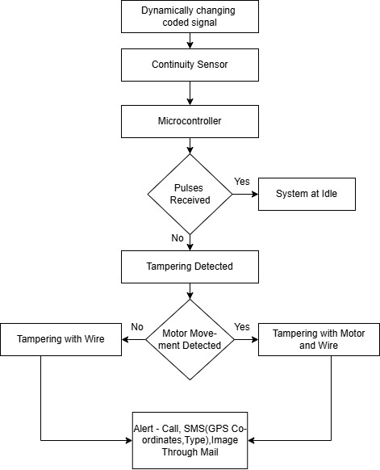

# 5. System Workflow

## Workflow Diagram

## Explanation

The system continuously transmits a coded signal through the motor cable.

* If pulses are received → System remains idle
* If pulses are not received → Tampering detected

The gyroscope sensor is used to classify the event:

* Movement detected → Motor and cable theft
* No movement → Wire theft

The system sends alerts via GSM along with GPS location and image capture.
